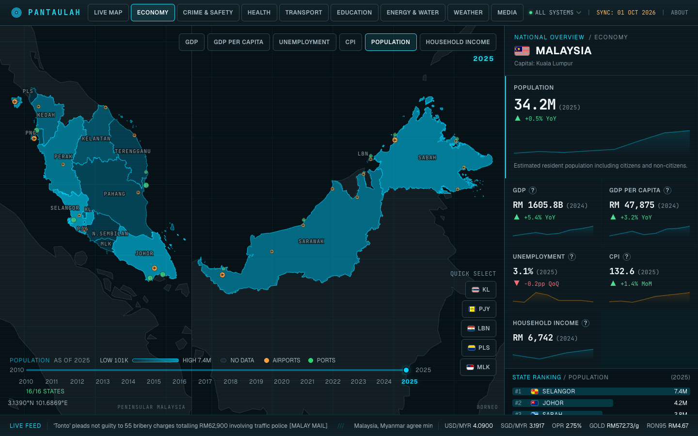

<p align="center">
  
</p>

<h1 align="center">PANTAULAH</h1>

<p align="center">Malaysia, at a glance.</p>

<p align="center">
  <a href="https://pantaulah.com">Explore the dashboard</a> ·
  <a href="docs/DATA.md">Data sources</a> ·
  <a href="CONTRIBUTING.md">Contribute</a>
</p>

An interactive dashboard for Malaysia, combining government statistics across all 16 states and federal territories with live weather, flood, transport, and flight feeds.



## Features

- **Explore 50+ metrics** across economy, crime, health, transport, education, and energy. Select a state to see trends, year-over-year changes, and sector breakdowns.
- **Follow live conditions** with weather forecasts, warnings, river levels, earthquakes, highway CCTV, transit positions, and aircraft tracking.
- **Navigate a 3D map** with terrain, buildings, satellite imagery, rain radar, wind, air quality, rail routes, and population layers.
- **Track national updates** through news headlines, exchange rates, fuel prices, gold prices, and the overnight policy rate.

Built with Next.js 16, React 19, TypeScript, MapLibre GL, D3-Geo, and Tailwind CSS. Deployed on Cloudflare Workers through OpenNext.

## Quick start

Use **Node.js 24** and npm. Node.js 24 matches the data-update workflow and supports the optional population-processing script.

```bash
git clone https://github.com/atzr95/pantaulah.git
cd pantaulah
npm ci
cp .env.example .env.local
npm run dev
```

Open [localhost:3000](http://localhost:3000).

Cached statistics and map geometry are included. You do not need to run ingestion to start the app. Core features do not require API keys; live feeds need internet access.

## Optional configuration

| Variable | Purpose |
| ---------- | --------- |
| `OPENSKY_CLIENT_ID` and `OPENSKY_CLIENT_SECRET` | Optional OpenSky authentication for flight tracking; adsb.lol is the fallback |
| `YOUTUBE_API_KEY` | Enables trending videos in the Media tab |

See [.env.example](.env.example). Keep credentials in `.env.local` for development and configure them as Worker secrets for deployment.

## Development

```bash
npm test       # Run tests
npm run lint   # Check code style
npm run build  # Build the Next.js app
```

Use `npm run test:watch` while working on tests. For architecture, production builds, and Cloudflare deployment, see the [development guide](docs/DEVELOPMENT.md).

## Data and coverage

Live feeds and historical statistics have different update schedules. Each metric's year and each feed's timestamp matter: refreshing the dashboard does not mean the source has published new data. Coverage also varies by source and location.

See the [data reference](docs/DATA.md) for providers, cache intervals, dataset years, ingestion commands, and map asset generation. A [scheduled workflow](.github/workflows/ingest.yml) refreshes datasets daily at 04:00 MYT.

## Contributing and support

Bug fixes, data corrections, and documentation improvements are welcome. Read [CONTRIBUTING.md](CONTRIBUTING.md) for setup, checks, and pull request guidance.

- Report bugs or incorrect data through [GitHub Issues](https://github.com/atzr95/pantaulah/issues).
- Report vulnerabilities privately using the process in [SECURITY.md](SECURITY.md).
- Read [PRODUCT.md](PRODUCT.md) and [DESIGN.md](DESIGN.md) for product direction and UI guidelines.

## License

Project code is licensed under [MIT](LICENSE). Data, imagery, and map assets remain subject to their providers' terms; see the [data reference](docs/DATA.md#attribution). Pantaulah is an independent project and is not affiliated with its data providers.
